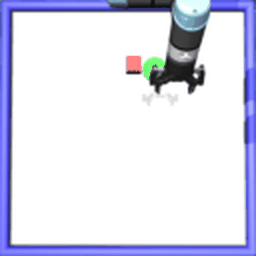
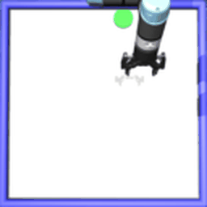
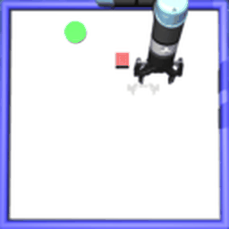
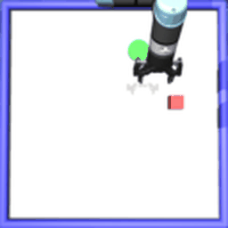
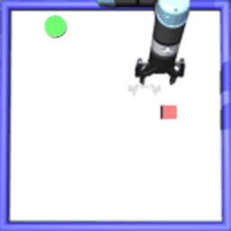
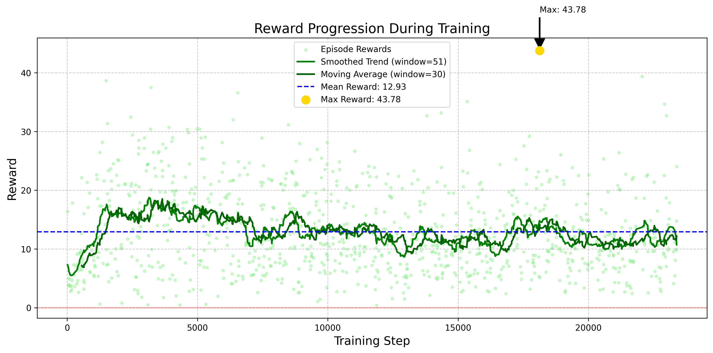
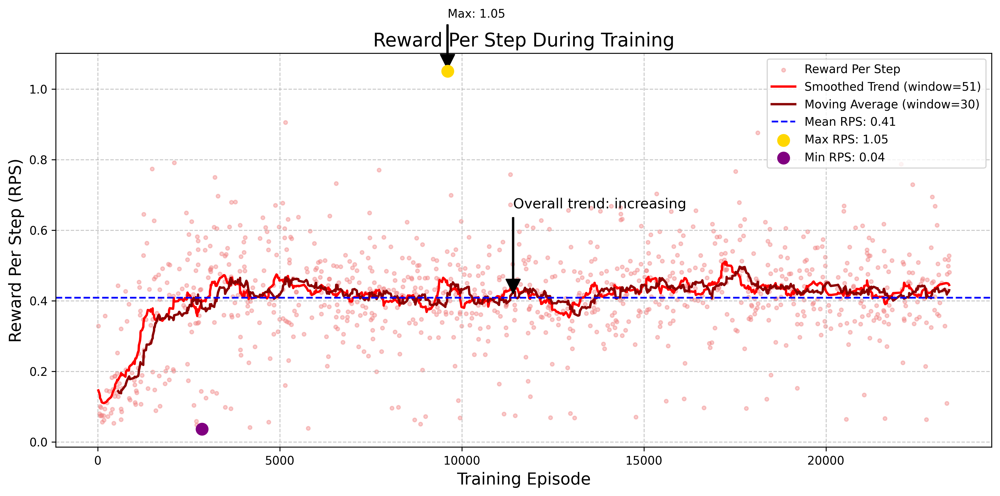

# CMPE591 Homework 2

Examples of Agent Behavior

<table> <tr> <td align="center"><b>Episode 1</b></td> <td align="center"><b>Episode 2</b></td> <td align="center"><b>Episode 3</b></td> <td align="center"><b>Episode 4</b></td> <td align="center"><b>Episode 5</b></td> </tr> <tr> <td></td> <td></td> <td></td> <td></td> <td></td> </tr> </table>
Training Analytics
Reward Progression
The plot below shows how total rewards evolved during training:

  

Reward Per Step Analysis
This plot shows the efficiency of the agent in collecting rewards over time:

  

Epsilon Decay
The exploration parameter (epsilon) decreased from 1.0 to 0.05 during training:

  

Success Rate
Succcess rate per 100 episodes through training.

  

