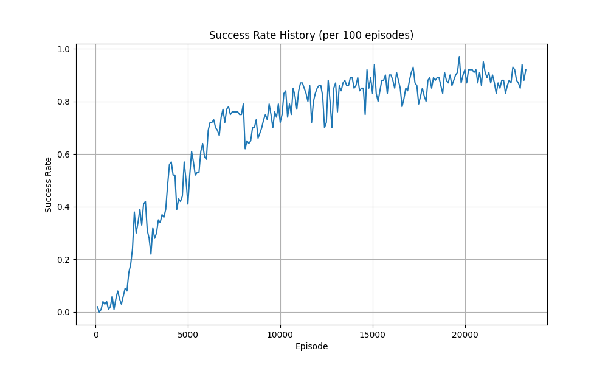
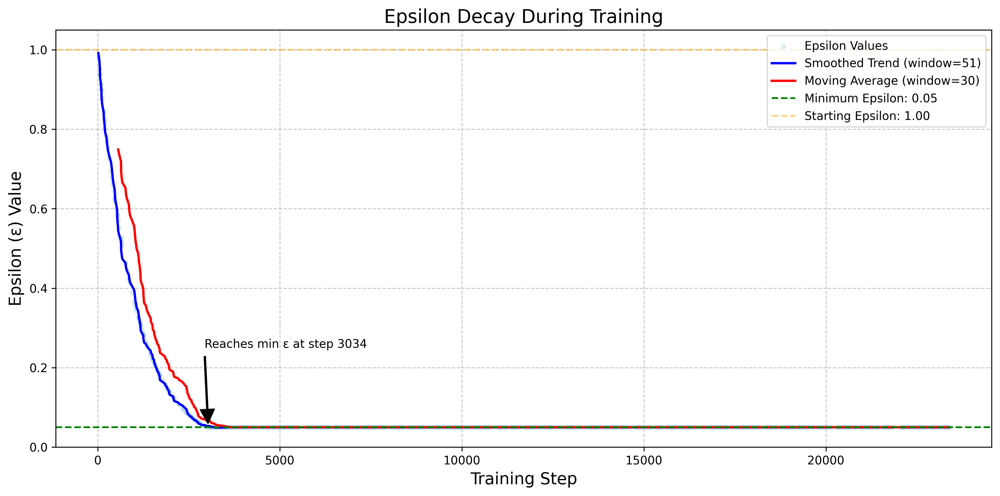

# cmpe591_hw2

homework2 for cmpe591

Since I played with the reward function, the plot is a bit different. But you can still see the model improvement.

### Example 1:

### Example 2:

### Score and Average Score Plot:

### Success Rate (If trained more, would converge to 100% probably, I accidentally stopped the training early.)

### Epsilon Plot:

